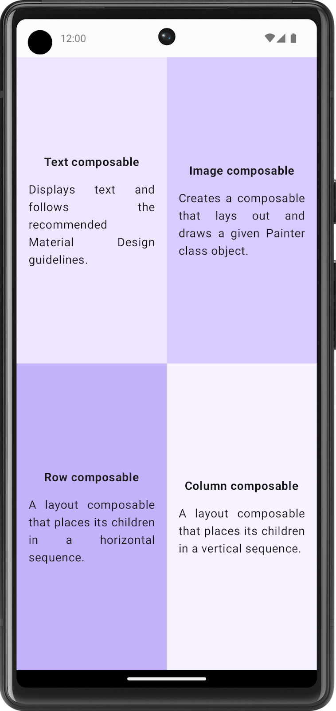
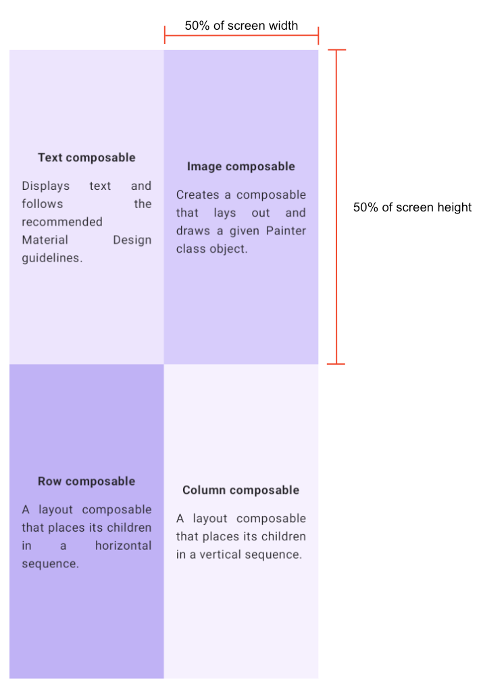
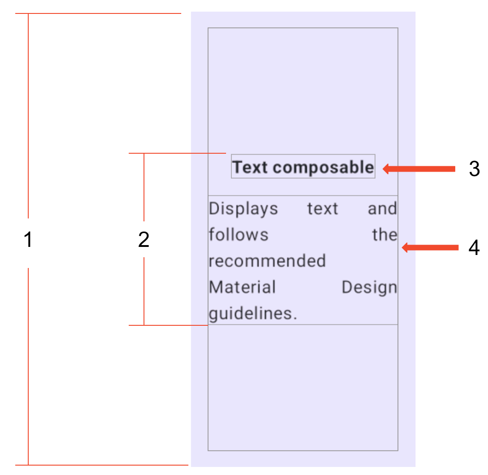

# Compose quadrant

In this exercise, you need to apply most of the concepts that you learned so far and then go a step
further to explore a new `Modifier` and properties. This might look like an extra challenge, but
don't
worry! You can check the **References** section for this problem, where you can find the links to
these
`Modifier` classes and properties, and use them for implementation.

You need to build an app that displays the information about the `Composable` functions that you
learned.

The screen is divided into four quadrants. Each quadrant provides the name of a `Composable`
function
and describes it in one sentence.

## Final screenshot

After you finish the implementation, your design should match this screenshot:

## UI specifications

Follow these UI specifications for the entire screen:

- Divide the entire screen into four equal parts, each of which contains a Compose card and displays
  information about a Composable function.

Follow these specifications for each quadrant:

- Set the entire quadrant (start, end, top, and bottom) to a 16dp padding.
- Center align all of the content vertically and horizontally in each quadrant.
- Format the first Text composable in bold and set it to a 16dp padding bottom.
- Set the second Text composable to a Default font size.

## Resources

These colors:

- Color(0xFFEADDFF)
- Color(0xFFD0BCFF)
- Color(0xFFB69DF8)
- Color(0xFFF6EDFF)

These strings:

- Text composable
- Displays text and follows the recommended Material Design guidelines.
- Image composable
- Creates a composable that lays out and draws a given Painter class object.
- Row composable
- A layout composable that places its children in a horizontal sequence.
- Column composable
- A layout composable that places its children in a vertical sequence.

